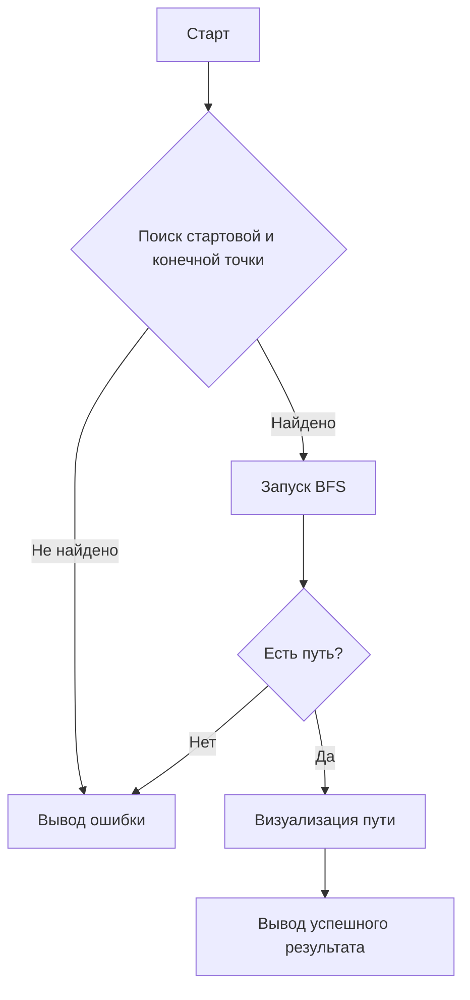
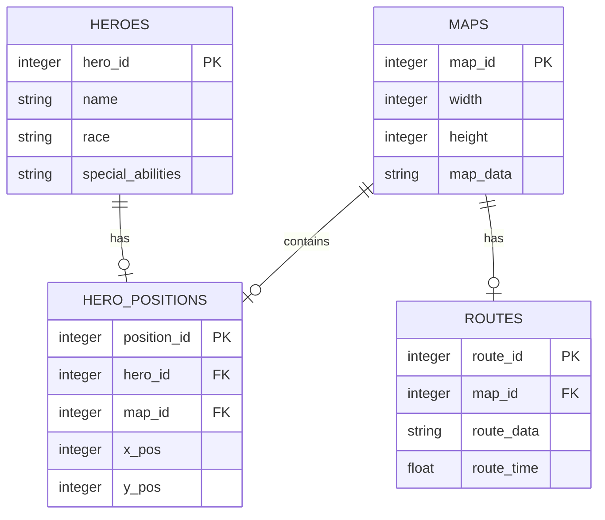

# PathFinder Documentation

## 1. Вербальная модель алгоритма

Алгоритм поиска пути работает следующим образом:

- Лабиринт представляется в виде двумерного массива символов, где:
  - `#` — стена (непроходимая клетка)
  - `1` — стартовая позиция
  - `F` — финиш (цель)
  - `_` — проходимая клетка
  - Дополнительные символы (`R`, `G`, `S`, и др.) обозначают клетки с разной стоимостью передвижения.
- Используется алгоритм поиска в ширину (BFS) с учетом стоимости передвижения по клеткам.
- Приоритет движений: вверх, вниз, влево, вправо.
- Если найден путь от старта до финиша — он визуализируется на `canvas`.
- Если пути нет, выводится сообщение об ошибке.

## 2. Математическая модель

- Лабиринт представляется как **взвешенный граф**, где:
  - Каждая клетка — **вершина**.
  - Проходимые клетки соединены **рёбрами**.
- Используется **поиск в ширину (BFS) с весами**:
  - Дерево поиска минимального пути строится с помощью BFS.
  - Функция стоимости перехода:
    \(f(x, y) = d + C\)
    где `d` — текущая длина пути, `C` — стоимость перехода по клетке.

## 3. Блок-схема алгоритма



## 4. Описание проекта

**PathFinder** — это проект для создания карт и маршрутов для поиска оптимальных путей в лабиринте. Он включает взаимодействие с базой данных, создание карт и героев, а также маршруты.

### 5. Структура проекта

```
db/              # Сценарии для инициализации базы данных
src/             # Исходный код приложения
requirements.txt # Зависимости Python
README.md        # Описание проекта
```

## 6. Установка и запуск

### Создайте виртуальное окружение:
```sh
python -m venv env
```

### Установите зависимости:
```sh
pip install -r requirements.txt
```

### Запустите приложение:
```sh
python src/app.py
```

### Для инициализации базы данных используйте:
```sh
python db/init_db.py
```

## 7. Лицензия

MIT

## 8. Примечания

- Для работы с картами и героями, данные о которых сохраняются в базе данных, необходимо предварительно инициализировать базу данных с помощью скрипта `init_db.py`.
- Приложение использует алгоритм поиска в ширину (BFS) с учетом стоимости переходов и предназначено для поиска кратчайшего пути в лабиринте.
- Приложение включает в себя механизмы для создания, редактирования и сохранения карт, героев и маршрутов, а также управления правами доступа.

## 9. Будущие улучшения и расширения

- **Поддержка дополнительных алгоритмов поиска:** можно добавить поддержку алгоритмов A* или Dijkstra.
- **Интерфейс с картами и маршрутами:** создание графического интерфейса для визуализации карт и путей.
- **Интеграция с внешними картами:** OpenStreetMap или Google Maps.
- **Оптимизация производительности:** параллельные вычисления и алгоритмы оптимизации, такие как A*.

## 10. Пример диаграммы базы данных



## 11. Структура тестов и покрытие

- Для автоматического тестирования проекта используется Jest.
- Тесты покрывают ключевые компоненты приложения, такие как алгоритмы поиска пути и взаимодействие с базой данных.
- Примеры тестов можно найти в каталоге `tests/`.

### Пример простого теста:

```javascript
describe("Pathfinding algorithm", () => {
    it("should find a path from start to finish", () => {
        const labyrinth = [
            ["#", "#", "#", "#", "#"],
            ["#", "1", "_", "F", "#"],
            ["#", "_", "_", "_", "#"],
            ["#", "#", "#", "#", "#"]
        ];
        const start = [1, 1];
        const end = [1, 3];

        const path = bfsWithCost(labyrinth, start);
        expect(path).toEqual([[1, 1], [1, 2], [1, 3]]);
    });
});
```

## 12. Дополнительные ресурсы

### Документация по алгоритму BFS:
- [Википедия - Алгоритм поиска в ширину](https://ru.wikipedia.org/wiki/Поиск_в_ширину)

### JSDoc:
- [Официальная документация JSDoc](https://jsdoc.app/)

### Инструменты для тестирования:
- [Jest - Официальный сайт](https://jestjs.io/)

---

Теперь файл содержит всю необходимую информацию, включая технические детали, примеры и ссылки на ресурсы, оформленные корректно в виде `.md` документа.
