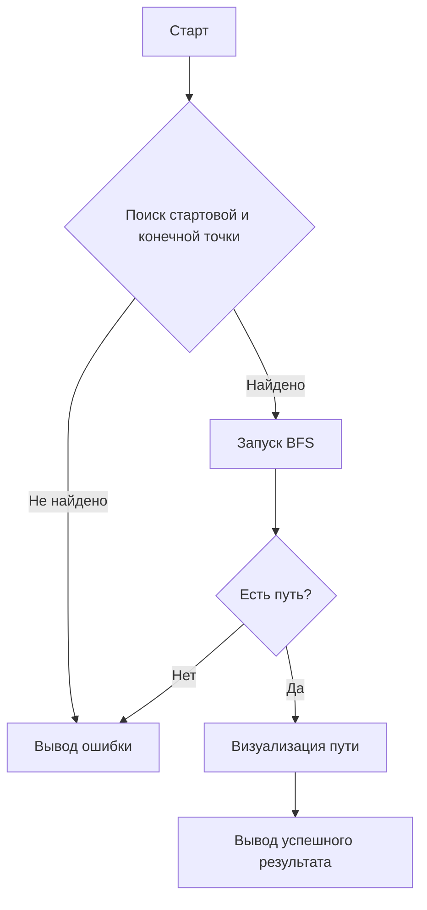

# PathFinder Documentation

## 1. Вербальная модель алгоритма

Алгоритм поиска пути работает следующим образом:

- Лабиринт представляется в виде двумерного массива символов, где:

  - `#` — стена (непроходимая клетка)
  - `1` — стартовая позиция
  - `F` — финиш (цель)
  - `_` — проходимая клетка
  - Дополнительные символы (`R`, `G`, `S`, и др.) обозначают клетки с разной стоимостью передвижения.

- Используется алгоритм поиска в ширину (BFS) с учетом стоимости передвижения по клеткам.

- Приоритет движений: вверх, вниз, влево, вправо.

- Если найден путь от старта до финиша — он визуализируется на `canvas`.

- Если пути нет, выводится сообщение об ошибке.

## 2. Математическая модель

- Лабиринт представляется как **взвешенный граф**, где:
  - Каждая клетка — **вершина**.
  - Проходимые клетки соединены **рёбрами**.
- Используется **поиск в ширину (BFS) с весами**:
  - Дерево поиска минимального пути строится с помощью BFS.
  - Функция стоимости перехода:\
    \(f(x, y) = d + C\)\
    где `d` — текущая длина пути, `C` — стоимость перехода по клетке.

## 3. Блок-схема алгоритма



## 4. Комментарии в коде

Ключевые части кода снабжены комментариями:

- **index.js**
  - Функция `bfsWithCost(labyrinth, start)` — реализация алгоритма поиска пути.
  - Функция `drawLabyrinth(labyrinth)` — визуализация лабиринта.
  - Функция `reconstructPath(prev, start, end)` — восстановление найденного пути.
  - Функция `startSearch()` — запуск поиска пути и обработка результата.

## 5. Автоматическая генерация документации

Для генерации документации используется **JSDoc**. Чтобы создать документацию:

1. Установите JSDoc:
   ```sh
   npm install -g jsdoc
   ```
2. Сгенерируйте документацию:
   ```sh
   jsdoc index.js -d docs
   ```
3. Откройте `docs/index.html` в браузере.

## 6. Система сборки

Для управления сборкой проекта используется **Webpack**:

- Установка зависимостей:
  ```sh
  npm install
  ```
- Запуск локального сервера для разработки:
  ```sh
  npm start
  ```
- Сборка проекта:
  ```sh
  npm run build
  ```

## 7. Управление ошибками

### Разделение ролей пользователей

- Система поддерживает несколько пользователей с разными ролями (админ, разработчик, тестировщик).

### Мониторинг ошибок

- Используется **Bug Tracking System** (например, GitHub Issues, Jira).
- Ведутся отчеты по количеству исправленных ошибок и прогрессу RoadMap.

### REST API

- Проект взаимодействует через REST API для обмена данными между клиентом и сервером.

### Система уведомлений

- Уведомления о ходе исправления ошибок отправляются в **Slack** / **Telegram**.

## 8. CI/CD и Автотесты

### Использование CI/CD (GitHub Actions, GitLab CI)

- Автоматический запуск тестов при каждом коммите.
- Разделение окружений (production / development).

### Unit-тестирование

- Покрытие кода тестами с использованием **Jest**.
- Запуск тестов:
  ```sh
  npm test
  ```
- Отчет о покрытии тестами:
  ```sh
  npm run coverage
  ```

---